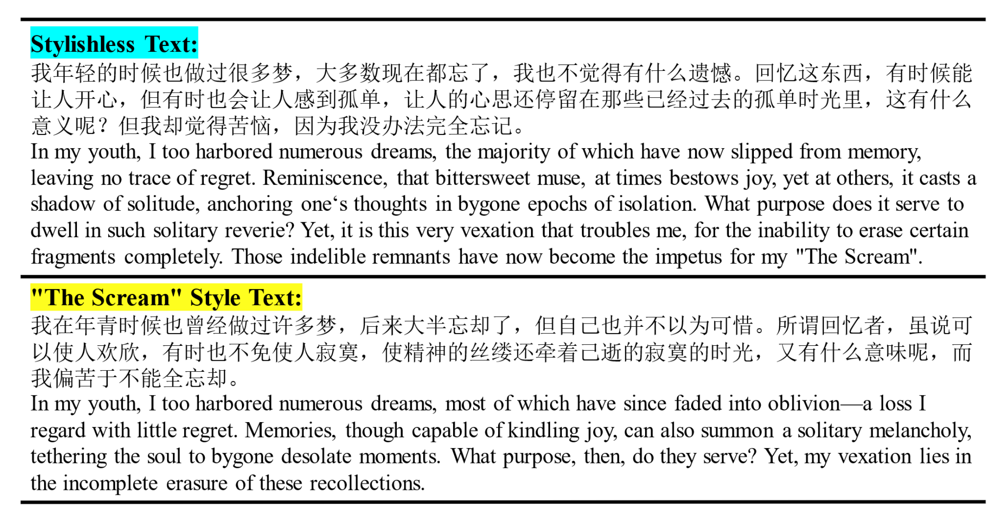
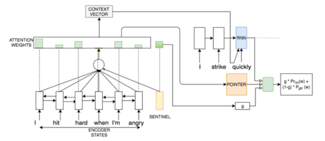
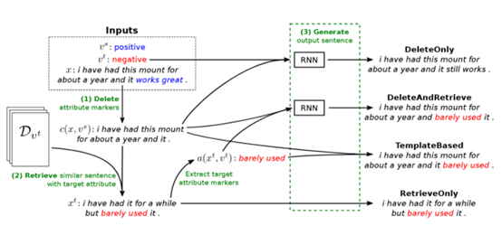
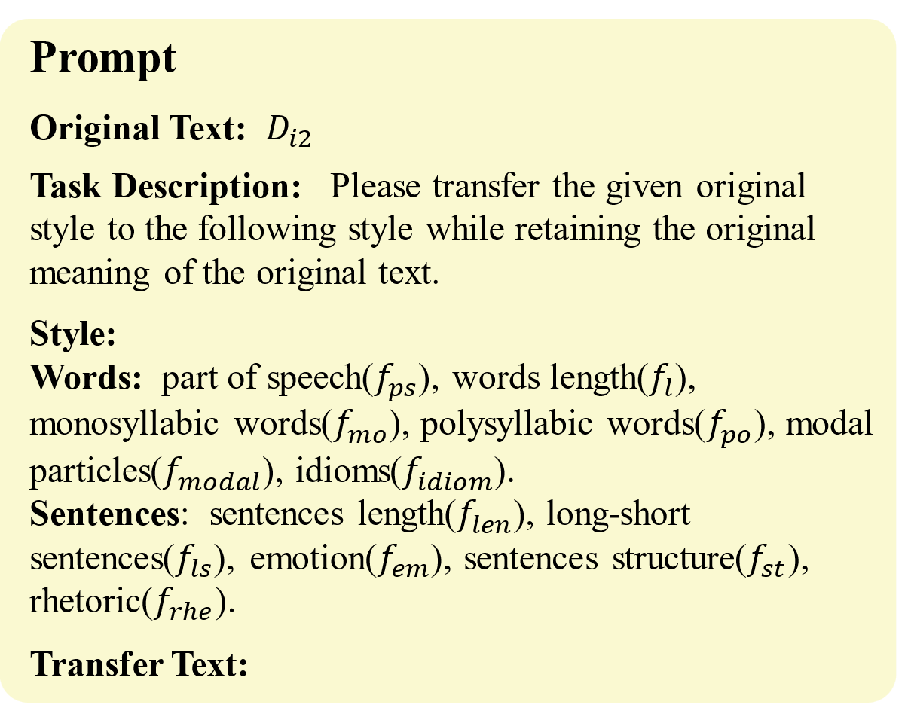
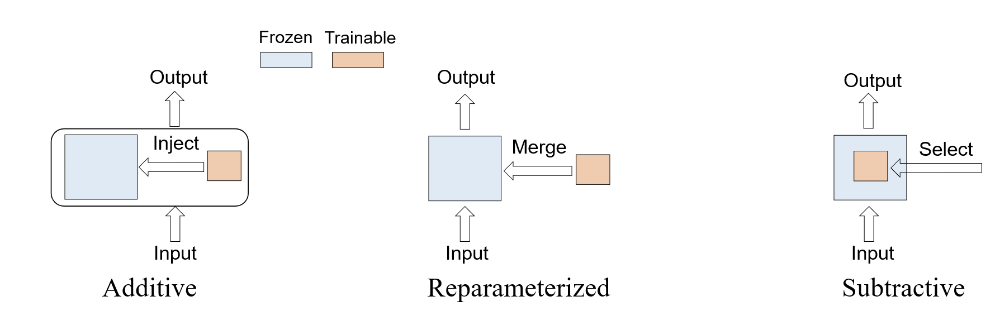
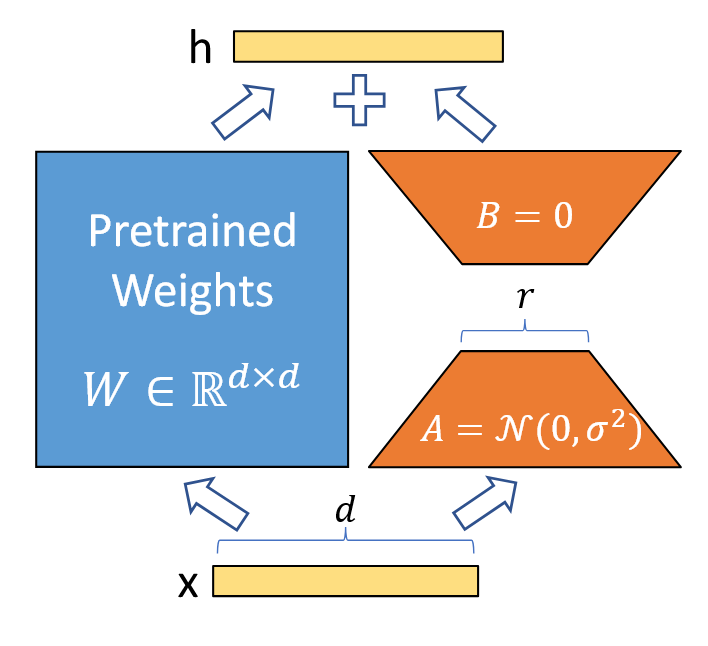
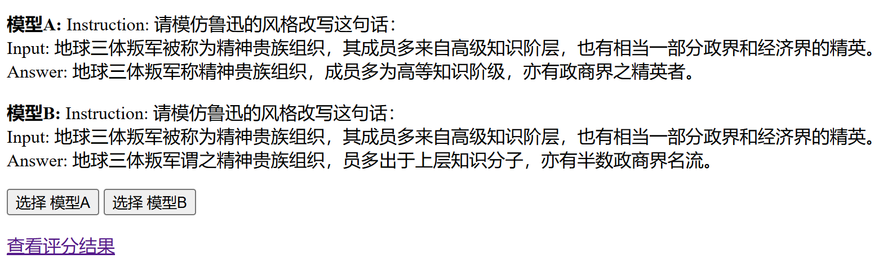
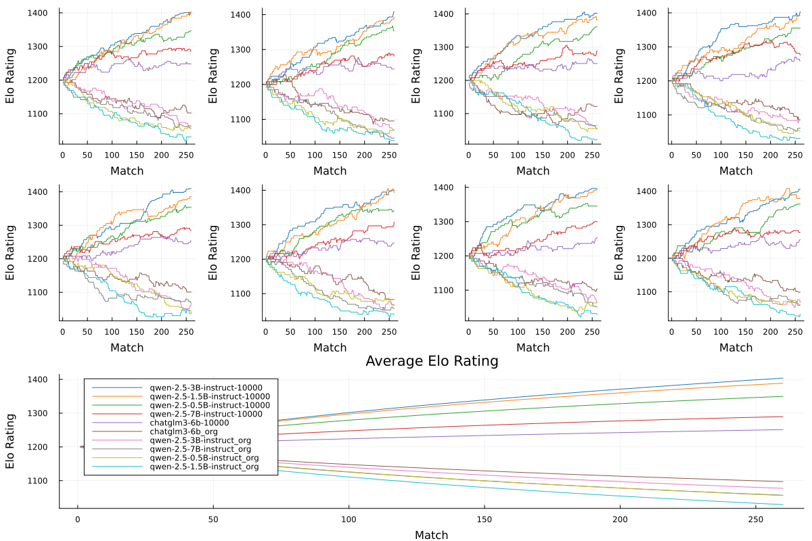
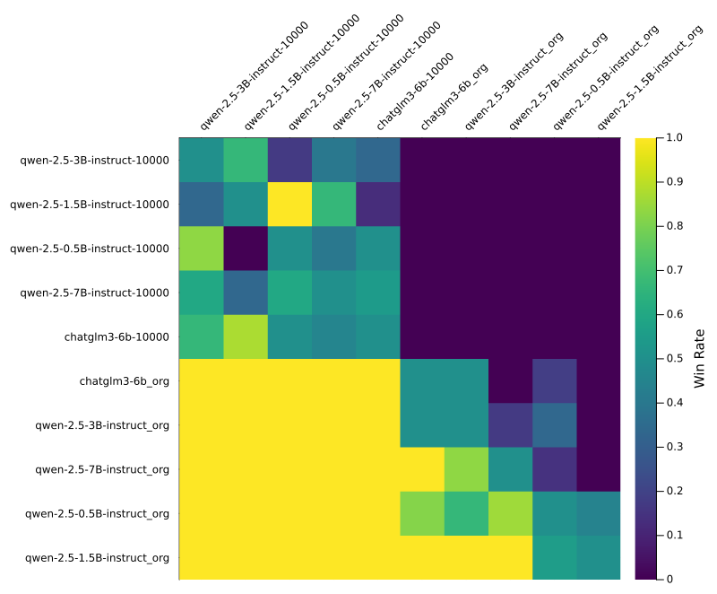

# 项目背景

## 任务定义

文本风格迁移（Text Style Transfer, TST）是自然语言生成中的一项关键任务，被定义为适应和/或改变句子的写作风格方式，同时保留原始句子的内容的任务 [1, 2]。与风格相反，内容可以理解为作者所写的主题、主题或话题，如图 1。

  
**图 1：文本风格迁移实例**

文本风格迁移的任务可以具体定义为：  
给定一个文本 \( x \)，具有原创风格 \( s \)，我们的目标是改写 \( x \) 使其进入文本 \( \hat{x} \) 具有目标风格 \( s' \neq s \)，同时保持其独立于风格的内容。  
假设我们有一个数据集 \( X_s = \{x_1^{(S)}, \dots, x_m^{(S)}\} \) 以风格表示文本 \( S \)。任务是改变文本的风格 \( S \) 到目标风格 \( S' \) 同时又保持原意。我们将这个转换的输出表示为 \( X_{s \to s'} = \hat{x}_1^{(S')}, \dots, \hat{x}_m^{(S')} \)。  
类似地，对于风格的逆转换 \( S' \to S \)，我们将输出表示为 \( X_{s' \to s} = \hat{x}_1^{(S)}, \dots, \hat{x}_m^{(S)} \)。

## 相关工作

主要分为使用并行数据、使用非并行数据和直接使用大语言模型（LLM）三种主要方法。

### 并行数据的监督训练

当有可用的、可并行的风格迁移数据时，可以直接训练 seq2seq 模型（LSTM/Transformer），类似机器翻译 [3]，模型结构如图 2。

  
**图 2：并行数据的监督训练的模型结构图**

### 非并行数据

有的方法基于短语替换：仅删除句子中代表源风格的部分，并将其替换为具有目标风格的单词，将修改后的文本输入序列输入到序列模型，以生成目标样式的流畅文本序列。但显然高度依赖特征工程和对不同风格特征词的提取和构造 [4]，如图 3。

  
**图 3：非并行数据中基于短语替换的方法框架**

还有的方法利用数据检索从两个单风格语料库中提取对齐的句子对来构造可并行的数据 [5]。

### 大语言模型

有的方法基于 Prompt engineering [6]，但是对提示词敏感，可能并不总能保持一致的性能，prompt 构造如图 4。

  
**图 4：基于大语言模型 prompt engineering 的 prompt 构造**

还有些方法基于大语言模型的微调 [7]。

---

# 数据集

## 数据预处理

我们使用的数据集为鲁迅作品的文本数据 [8]，存储在一个 JSON 文件（`luxun.json`）中。该开源数据集包含多篇鲁迅的文章，每篇文章以列表形式存储，其中最后一个元素为文章的内容。首先对这些文本进行预处理，以便后续的分析或模型训练：

- **文本清洗**：
  - 去除标题：通过识别第一个中文字符的位置，找到标题的起始和结束位置，并将其从文本中去除，仅保留文本内容。
  - 去除空白字符：使用正则表达式去除文本中的空白字符、换行符、制表符等无关字符，以便后续训练使用。
- **句子分割与过滤**：将每篇文章的文本内容分割成句子，并过滤掉过短的句子（默认长度小于 10 的句子被过滤掉）。句子分割的依据是中文标点符号，如句号（。）、感叹号（！）、问号（？）和省略号（……）。将所有处理后的句子合并成一个列表，并将其保存为 JSON 文件（`sentences.json`），以便后续使用。
- **统计中文字符数**：统计所有句子中的中文字符总数。

## 数据集统计

- **总句子数**：108,131。
- **总中文字符数**：2,729,884。

## 数据合成

在数据预处理完成后，我们开始数据合成阶段。该阶段的目标是通过调用 API 将鲁迅作品中的文言文或复杂中文句子翻译为现代白话文，从而构建 `白话-鲁迅风格` 句子对。

### API 翻译

- **初始化翻译 API**：使用 DeepSeek API 进行翻译，并设置翻译任务的 Prompt，确保翻译结果符合现代白话文的风格，同时设计 Prompt 的长度需要适宜，以利用 DeepSeek API 的上下文 cache 功能，避免 cache miss 浪费。
- **Prompt 设计**：
  - **系统提示词（System Prompt）**：  
    你是一个中文翻译助手，负责将鲁迅写出的文言文或复杂的中文句子翻译为现代白话文。注意保证内容的一致性，信达雅。灵活处理一些古文中的含义，尽量使用更现代化的语句。如果包含一些外文，照常翻译为外语。
  - **用户输入（User Input）**：  
    将以下句子翻译为白话文，只返回翻译结果：
- **批量翻译与并发请求**：将句子列表分成多个批次，使用 `ThreadPoolExecutor` 多线程并发请求 API 翻译。每个批次的翻译结果保存为一个单独的 JSON 文件，最后合并。
- **翻译结果清洗与处理**：API翻译的结果并不能完全遵从指令，需要手动处理不符合要求的翻译结果。

### 数据合成结果

- **总翻译句子数**：108,131。
- **翻译结果格式**：  
  翻译结果以 JSON 格式存储，每个句子对包含以下字段：

  ```json
  {
    "context": "Instruction: 将这句话改写成鲁迅风格的语言\nInput: 虽然打高尔夫、脱钩和参加豪门社交都是炫耀身份的行为，但如此疯狂追求名利地步就算被曝出丑闻，也不为过。\nAnswer: ",
    "target": "“打高尔夫”“脱钩”，“豪门社交”的熏灼之状，竟至于斯，则虽报以丑闻，亦不为过。"
  }
  ```

  其中：
  - `context`：包含任务指令（Instruction）和输入句子（Input）。
  - `target`：鲁迅风格的目标句子（Answer）。

---

# 模型微调

## 方法介绍

参数高效微调（PEFT）方法使我们能够通过微调模型的特定部分，而非整个模型来改变其行为。通常，这些方法主要关注模型中某些参数或组件。图片中展示了三种主要策略：加法（Additive）、重参数化（Reparameterized）和减法（Subtractive），如图 5。

  
**图 5：大模型参数高效微调方法示意图**

### 加法方法（Additive Method）

加法方法通过向模型中注入额外的可训练参数来增强模型的表现。在微调过程中，这些参数是可以学习的，而其余的模型参数则保持不变。通过将可训练参数注入网络，帮助模型在特定任务中提高性能。

### 重参数化方法（Reparameterized Method）

重参数化方法通过将额外的参数与模型现有的参数合并，从而改变模型的行为，而不需要修改整个架构。这些可学习的参数帮助重新定义问题或使模型适应新的任务。

### 减法方法（Subtractive Method）

减法方法专注于从模型中选择特定的组件或输出，并对其进行减法操作。通过这种方式，能够去除或减少不重要的参数，同时保留对任务至关重要的特征。

在本项目中，使用 LoRA [9] 方法对模型进行参数高效微调，方法示意图如图 6。

  
**图 6：LoRA 微调方法示意图**

LoRA（Low-Rank Adaptation）方法主要用于在大模型上进行高效微调。在这种方法中，核心思想是通过引入低秩矩阵来替代传统的全秩矩阵，从而减少计算和存储开销。具体实现过程如下：

给定预训练的权重矩阵 \( W \in \mathbb{R}^{d \times d} \)，LoRA 通过在权重矩阵中引入一个低秩适应矩阵来调整原有的模型权重。LoRA 的基本思路是将原有的权重矩阵 \( W \) 通过低秩矩阵分解的形式进行修改，如下所示：

\[
W' = W + A \cdot r
\]

其中，\( A \in \mathbb{R}^{d \times r} \) 是低秩矩阵，\( r \) 是训练过程中学习的可训练参数，\( r \) 的秩小于 \( d \)，从而使得 LoRA 只需要微调较少的参数。

在训练过程中，LoRA 方法通过如下步骤实现高效微调：
- 首先，冻结原有的预训练权重 \( W \)。
- 然后，引入两个低秩矩阵 \( A \) 和 \( B \)，其中 \( B = 0 \)，并且 \( A \) 由标准正态分布 \( N(0, \sigma^2) \) 初始化。
- 通过训练 \( A \) 和 \( r \) 来适应新的任务，从而使得网络能够在新的任务上获得较好的表现，同时减少了微调的参数量。

\[
A = N(0, \sigma^2)
\]

这样，LoRA 方法通过引入低秩适应矩阵来微调网络，而无需对所有权重进行重新训练，从而显著减少了训练的成本。

## 具体实现

采用 transformers [10] 和 PEFT [11] 实现大模型的 LoRA 微调。

### 模型选择

为了测试不同厂家、不同参数量模型的微调效果，我们选择了 qwen-2.5-0.5b-instruct、qwen-2.5-1.5b-instruct、qwen-2.5-3b-instruct、qwen-2.5-7b-instruct [12] 和 chatglm3-6b [13] 模型进行微调。

### 训练参数

训练超参数如表 1 所示。需要注意的是，由于硬件条件限制，仅使用构造数据集中的 10000 条数据进行训练。

**表 1：与训练相关的超参数及其默认值**

| 超参数 | 说明 | 默认值 |
| --- | --- | --- |
| `batch_size` | 训练批量大小 | 1 |
| `epochs` | 训练的轮数 | 3 |
| `learning_rate` | 学习率 | 1e-4 |
| `max_seq_length` | 最大序列长度 | 100 |
| `gradient_accumulation_steps` | 梯度累积步数 | 2 |
| `train_subset_size` | 从训练数据集中选择的样本数 | 10000 |
| `save_strategy` | 保存策略，设置为“steps”表示按步保存 | steps |
| `save_steps` | 每多少步保存一次模型 | 500 |
| `save_total_limit` | 最多保存模型数量 | 2 |
| `logging_steps` | 每多少步记录一次日志 | 100 |
| `per_device_train_batch_size` | 每个设备上的训练批量大小 | 1 |
| `dataloader_drop_last` | 是否丢弃数据集的最后一个不完整批次 | True |
| `fp16` | 是否启用混合精度训练 | True |

---

# 结果评测

## 评测方式

评测方式参考大模型竞技场 [14] 的设计，具体流程如下：

1. **评测页面**：每次评测页面显示两个模型针对同一句话的转换结果，人工选择更好的一个，如图 7。
2. **对局记录**：每一次选择被视为两个模型之间的一次对局，记录胜负结果。
3. **Elo 评分**：基于对局结果序列，使用 Elo 评分规则为模型打分。

  
**图 7：Elo 评分页面**

## Elo 分数计算方法

Elo 分数是一种用于评估竞争性对局中参与者相对实力的评分系统。其核心思想是通过对局结果动态调整参与者的分数。具体计算方法如下：

1. **预期胜率**：参与者 \( A \) 对参与者 \( B \) 的预期胜率 \( E_A \) 计算公式为：
   \[
   E_A = \frac{1}{1 + 10^{(R_B - R_A) / 400}}
   \]
   其中，\( R_A \) 和 \( R_B \) 分别为参与者 \( A \) 和 \( B \) 的当前 Elo 分数。

2. **分数更新**：根据实际对局结果，参与者 \( A \) 的新 Elo 分数 \( R_A' \) 计算公式为：
   \[
   R_A' = R_A + K \times (S_A - E_A)
   \]
   其中：
   - \( K \) 为调整系数，通常取值为 32；
   - \( S_A \) 为实际对局结果，胜利为 1，平局为 0.5，失败为 0。

## 随机性问题与解决方法

由于 Elo 评分依赖于对局顺序，导出的评分具有随机性（如图 8 上方小图所示）。同时，由于人工标注的结果较少，排名结果的随机性较高。为解决这一问题，采用以下方法：

- **多次打乱对局顺序**：将对局序列打乱足够多次，每次计算 Elo 分数。
- **取平均分数**：将多次计算的 Elo 分数取平均值，得到与对局顺序无关的稳定 Elo 分数（如图 8 下方大图所示）。

  
**图 8：Elo 评分过程示意图**

## 模型间胜率分析

图 9 展示了模型间对比时的胜率热力图。从图中可以看出：热力图的左下角和右上角呈现出明显的方形结构。这些方形结构表明，微调后的模型（无论参数量多少）整体上优于微调前的模型。

  
**图 9：模型间胜率示意图**

**表 2：模型的 Elo 分数（按分数降序排列）**

| Elo 分数 | 模型名称 |
| --- | --- |
| 1403.8 | qwen-2.5-3B-instruct-10000 |
| 1388.7 | qwen-2.5-1.5B-instruct-10000 |
| 13497 | qwen-2.5-0.5B-instruct-10000 |
| 1286.6 | qwen-2.5-7B-instruct-10000 |
| 1251.4 | chatglm3-6b-10000 |
| 1100.4 | chatglm3-6b_org |
| 1077.5 | qwen-2.5-3B-instruct_org |
| 1056.8 | qwen-2.5-7B-instruct_org |
| 1056.0 | qwen-2.5-0.5B-instruct_org |
| 1029.2 | qwen-2.5-1.5B-instruct_org |

---

# 部署与前端设计

在模型微调完成后，我们将其部署为一个基于 Flask 的 Web 服务，并设计了一个简单的前端界面，方便用户与模型进行交互。

## 模型部署

我们租用了阿里云-云服务器-ECS，其信息如下：

**表 3：服务器硬件配置**

| 硬件类型 | 规格 |
| --- | --- |
| Architecture | x86_64 |
| CPU(s) | 16 |
| CPU Model name | Intel(R) Xeon(R) Platinum 8369B CPU @ 2.70GHz |
| GPU | NVIDIA A10 GPU Accelerator with 22GB |

- **环境准备**：
  - Python 环境：使用 Python 3.8。
  - 依赖库：安装 Flask、PyTorch、Transformers 和 PEFT 等依赖库。
  - 硬件配置：使用 NVIDIA A10 GPU 加速推理。
- **推理服务**：
  - Flask 应用：使用 Flask 框架搭建 Web 服务，提供模型推理接口，采用串行响应。
  - 日志记录：记录每次请求的输入和输出，便于后续分析和调试。
  - 输入处理：对用户输入进行校验，确保输入文本不为空。
  - 推理输出：根据用户请求需求加载不同模型并编码推理，将结果 POST 回用户。
- **模型加载与内存管理**：受限于部署环境资源，我们采用动态加载模型以满足推理需求。
  - 模型加载：根据用户请求的模型类型，动态加载对应的模型和分词器。
  - 内存管理：通过监控 GPU 内存使用情况，动态卸载部分模型以释放内存。在用户请求后，首先判断该模型是否已经加载。如果没有，则根据当前 GPU 内存使用情况，判断是否有足够空间加载新模型。如果空间不足，则优先释放小参数量的模型，以避免对大参数模型的反复加载，从而节省时间。
  - CPU 备用：对于内存需求较大的模型（如 `qwen-2.5-7B-instruct-10000`），将其加载到 CPU 上以实现推理。
- **启动服务**：
  - 主机与端口：服务运行在 `0.0.0.0` 主机和 `80` 端口，由服务器本身的公网 IP 支持外部访问。
  - 多模型支持：通过 Web 路由动态加载不同模型。

## 前端设计

---

# 总结

---

## 参考文献

1. Mukherjee, S., & Toshevska, M. (2024). Text Style Transfer: A Review.  
2. Toshevska, M. (2021). A Comprehensive Review of Text Style Transfer.  
3. Jhamtani, H. (2017). Shakespearizing Modern Language Using Copy-Enriched Sequence-to-Sequence Models.  
4. Li, J. (2018). Delete, Retrieve, Generate: A Simple Approach to Text Style Transfer.  
5. Jin, D. (2019). Imat: Unsupervised Text Style Transfer via Iterative Matching and Translation.  
6. Tao, L. (2024). Cat: Context-Aware Text Style Transfer with Prompt Engineering.  
7. Mukherjee, S. (2024). Large Language Models for Text Style Transfer.  
8. sun510001. (2023). luxun\_dataset. GitHub repository.  
9. Hu, J. (2021). LoRA: Low-Rank Adaptation of Large Language Models.  
10. Wolf, T. (2020). Transformers: State-of-the-Art Natural Language Processing.  
11. PEFT: Parameter-Efficient Fine-Tuning.  
12. Qwen-2.5: A Series of Large Language Models.  
13. ChatGLM3-6B: A Chinese Language Model.  
14. Chatbot Arena: A Platform for Evaluating Large Language Models.